# **MS103 / Tom Sikora**
# 1) Configuration d'un poste de travail sous Linux

<br>

**Sommaire**
- Partie 1 : [TP d'installation](https://iut-info.univ-reims.fr/users/cutrona/restricted/installation-configuration/linux/) jusqu'à la partie 10.3 incluse
  - 4) Création de votre machine virtuelle dans OpenNebula
  - 5) Utilisation de « Remote Viewer » pour accéder à votre machine virtuelle OpenNebula
  - 6) Installation d'une distribution Xubuntu
    - 6.1) Configuration des partitions de stockage
    - 6.2) Première connexion et environnement de travail
  - 7) Découverte de la configuration d'un système Linux Ubuntu
  - 8) Gestion des utilisateurs
    - 8.1) Configuration et utilisation de la commande sudo
    - 8.2) Gestion des utilisateurs
  - 9) Le système de fichiers
    - 9.1) Liens symboliques
    - 9.2) Étude de l’arborescence Linux Standard (FHS)
  - 10) Installation d'outils essentiels
    - 10.1) Outils présents dans les dépôts Ubuntu
    - 10.2) Outils présents dans des dépôts autres que ceux d'Ubuntu
    - 10.3) Outils sous forme de paquet deb
- Partie 2 : Création d'utilisateurs

- Partie 3 : Installation d'outils

- Structure du projet

- Problèmes rencontrés

<br>

<hr>

<br>

## Partie 1 : [TP d'installation](https://iut-info.univ-reims.fr/users/cutrona/restricted/installation-configuration/linux/) jusqu'à la partie 10.3 incluse

## 4) Création de votre machine virtuelle dans OpenNebula
1. Accès à l'interface Web du cloud [OpenNebula](http://one-frontend:9869/)
2. Connexion avec notre compte universitaire pour accéder à notre tableau de bord
3. Ajout d'une nouvelle machine virtuelle
4. Choix du modèle "template"
5. Sélection du modèle "TP Install Ubuntu"
6. Saisie du nom de la machine "Install Ubuntu" avec une taille de disque dur de 25GB
7. Le second lecteur de notre machine virtuelle permet de selectionner la taille de l'image ISO du DVD de Fedora
8. Le bouton "Create" permer de créer et lancer le déploiement de la machine virtuelle
9. Le voyant orange montre que la machine virtuelle est en cours de déploiement, selection du nom de la machine virtuelle
10. Affichage des détails de notre machine virtuelle qui indiquent son stade de déploiement
11. Attendre le déploiement complet de la machine virtuelle ("RUNNING" ou voyant vert)
12. Sélection du boutton d'affichage de la machine virtuelle
13. Lancement de l'installation de la distribution Ubuntu
14. Augmentation de la résolution de l'écran virtuel et poursuite de l'installation
15. Commencement de l'installation de notre distribution Linux

<br>

<hr>

<br>

## 5) Utilisation de « Remote Viewer » pour accéder à votre machine virtuelle OpenNebula
1. Téléchargement de la machine vituelle
2. Lancement de la machine vituelle en format .vv
- Soit en double-cliquant sur le fichier "Install Ubuntu.vv"
- Soit dans un terminal avec la commande :
``` HTTP
remote-viewer répertoire/où/vous/avez/rangé/le/fichier/Install\ Ubuntu.vv
```

<br>

<hr>

<br>

## 6) Installation d'une distribution Xubuntu
1. Choix de lancer la distribution en live CD ou de démarrer directement l'installation
2. Sélection de "Français" puis sélection d'"Installer Xubuntu"
3. Sélection de la disposition du clavier en "French"
4. Désactivation des mises à jour pendant l'installation

<br>

### 6.1) Configuration des partitions de stockage
1. Choix du type d’installation afin d'organiser notre disque dur pour accueillir le système d’exploitation Ubuntu
2. Sélection de "Nouvelle table de partition"
3. Confirmation et initialisation du système de partitionnement du disque
4. Création des partitions :
- Partie 1 : Taille 500 Mo, primaire, système de fichiers "ext4" et un montage en /boot
- Partie 2 : Taille 1500 Mo, primaire, utilisé comme "espace d’échange" et un montage en swap
- Partie 3 : Taille 15000 Mo, type logique, système de fichier "ext4" et un montage en /
- Partie 4 : Taille espace restant, type logique, système de fichier ext4 et un montage en /home
5. Validation de notre système de partitionnement
6. Choix de notre fuseau horaire à Paris
7. Renseignement des informations du premier utilisateur de notre système :
- Nom : IUT
- Nom de notre ordinateur : iut-VirtualBox
- Nom d'utilisateur : iut
- Mot de passe : iutinfo
8. Démarrage de l'installation
9. Sélection de "Redémarrer maintenant"
10. Sélection de la touche "Entrer"
11. Redémarrage de la machine virtuelle sur Xunbuntu
12. Première connexion

<br>

### 6.2) Première connexion et environnement de travail
- Redémarrage de notre système après saisie de notre mot de passe :
```
sudo reboot
```
1. Recherche des paramètres d'affichage dans le menu des applications
2. Résolution faible
3. Augmentation de la résolution par rapport à la résolution native de notre écran

<br>

<hr>

<br>

## 7) Découverte de la configuration d'un système Linux Ubuntu
- Affichage de la version du noyau Linux installé :
```
uname -r
```
1. Mise à jour de la liste des fichiers disponible dans le dépôt :
```
sudo apt update
```
2. Mise à jour des paquets installés :
```
sudo apt dist-upgrade
```
3. Liste l’ensemble des paquets installés en filtrant l’affichage aux paquets contenant le mot firefox :
```
dpkg -l | grep "firefox"
```
4. Installation du paquet "vim-gui-common" qui est un éditeur de texte avancé :
```
sudo apt install vim-gui-common
```
5. Recherche du paquet des fichiers de base de l'outil de capture photo/vidéo Cheese dans la liste des paquets installés :
```
dpkg -l | grep "Cheese"
```
- Suppression du paquet "cheese-common" de notre système :
```
sudo apt remove cheese-common
```

<br>

<hr>

<br>

## 8) Gestion des utilisateurs
### 8.1) Configuration et utilisation de la commande sudo
1. Selon les droits de l'utilisateur "iut", je peux visionner le fichier mais pas le modifier. Avec la commande "sudo", le mot de passe de l'utilisateur est demandé et le fichier peut finalement être modifié
```
sudo evim /etc/sudoers
```
2. Ouverture du fichier "group" qui contient les noms du groupe, le numéro d’identification du groupe (gid) et la liste des utilisateurs du groupe
```
sudo evim /etc/group
```
3. Sans "sudo", je peux visionner le fichier (*group*) mais pas le modifier
```
grep "sudo" /etc/group
```
- Résultat : <span style="color:green">sudo:x:27:iut</span>
    - le nom du groupe est "sudo"
    - le gid du groupe est "27"
    - l'utilisateur du groupe est "iut"
4. Non car comme précédemment, je peux visionner le fichier (*syslog*) sans utiliser "sudo"
5. Ici, j'ai besoin de la commande  "sudo" pour visionner le fichier (*shadow*)

<br>

### 8.2) Gestion des utilisateurs
#### **Partie 1**
1. Ouverture du manuel de *adduser* :
```
man adduser
```
2. L'uid de iut est **1000** : <span style="color:green">uid=1000(iut)</span>
3. Le groupe principal de iut est **adm** ou **administrateur** : <span style="color:green">adm:x:4:syslog,iut</span>
4. L’uid du prochain utilisateur créé par défaut sera **1001**
5. Création du groupe *invite* :
```
sudo addgroup invite
```
6. Création d'un nouvel utilisateur :
```
sudo adduser --home /home/utilisateur1 --ingroup user1
```
- le nom de l'utilisateur est user1
- le répertoire d'accueil de l'utilisateur est */home/utilisateur1*
7. <span style="color:purple">CTRL+ALT+F1</span> : Affichage de la console de connexion en mode texte
8. Connexion à l'utilisateur user1 :
- Nom d'utilisateur : user1
- Mot de passe : user1
- Affichage du chemin absolu :
```
pwd
```
9. Replacement sur l'utilisateur iut :
- Déconnexion de l'utilisateur user1 :
```
exit
```
- <span style="color:purple">CTRL+ALT+F7</span> : Affichage de la console de connexion en mode graphique
- Connexion plus pratique à l'utilisateur user1 :
```
su - user1
```
- Affichage de l'utilisateur (user1) :
```
echo $USER
```

<br>

#### **Partie 2**
1. Ouverture du fichier (*syslog*) mais user1 ne fait pas partie du groupe sudo et donc ne peut pas ouvrir ce fichier
```
sudo evim /var/log/syslog
```
2. Changement des privilèges de l’utilisateur user1
- Déconnexion de l'utilisateur user1 :
```
exit
```
- Ajout de l'utilisateur user1 au groupe adm (administrateur) :
```
sudo adduser user1 adm
```
3. Connexion à l'utilisateur user1 :
```
su - user1
```
- Ouverture du fichier (*syslog*) :
```
sudo evim /var/log/syslog
```
- Sans sudo = permission de lecture mais pas d'écriture
- Avec sudo = permission de lecture et d'écriture
4. Déconnexion de l'utilisateur user1  :
```
exit
```

<br>

<hr>

<br>

## 9) Le système de fichiers
### 9.1) Liens symboliques
1. Listage du contenu du dossier *(/lib)*, les fichiers dont le type est désigné par **l** correspond à un lien symbolique :
```
ls -la /usr/lib
```
2. Création d'un lien symbolique vers */tmp* avec le nom "monTemp" dans notre répertoire d’accueil :
```
ln -s /tmp monTemp
```

<br>

### 9.2) Étude de l’arborescence Linux Standard (FHS)
1. Documentation wikipedia du [FHS](https://fr.wikipedia.org/wiki/Filesystem_Hierarchy_Standard)
2. Affichage du fichier (*cpuinfo*) contenant les informations du processeur :
```
cat /proc/cpuinfo
```
- Le type du processeur est "Xeon"
- La fréquence du processeur est de 2194.842 MHz ou 2.20 GHz
3. Affichage du fichier (*bash-completion*) contenant le manuel de la commande "bash" :
```
cat /usr/share/bash-completion/bash-completion
```
4. Affichage du fichier (*version*) :
```
cat /proc/version
```
- La version du noyau est 5.15.0-48-generic
5. Le répertoire qui regroupe les logs du système est */var/log/syslog*

<br>

<hr>

<br>

## 10) Installation d'outils essentiels
### 10.1) Outils présents dans les dépôts Ubuntu
1. Installation du paquet "git" :
```
sudo apt install git
```
2. Installation du paquet "vlc" :
```
sudo apt install vlc
```

<br>

### 10.2) Outils présents dans des dépôts autres que ceux d'Ubuntu
1. Installation de **Google Chrome**
- Documentation [Ubuntu concernant Google Chrome](https://doc.ubuntu-fr.org/google_chrome)
- Ajout du dépôt de Google à nos dépôts connus :
```
sudo sh -c 'echo "deb [arch=amd64] https://dl.google.com/linux/chrome/deb/ stable main" > /etc/apt/sources.list.d/google-chrome.list'
```
- Ajout de la clé publique du dépôt à notre liste de clés fiables :
```
wget -q -O - https://dl-ssl.google.com/linux/linux_signing_key.pub | sudo apt-key add -
```
- Mise à jour de notre liste de paquet :
```
sudo apt update
```
- Installation de Google Chrome dans sa version stable :
```
sudo apt install google-chrome-stable
```

<br>

### 10.3) Outils sous forme de paquet deb
1. Installation de Teams
- Téléchargement de [Teams](https://www.microsoft.com/fr-fr/microsoft-teams/download-app) sous forme de paquet DEB
- Ouverture d'un terminal
- Installation du paquet DEB :
```
sudo dpkg -i ~/Téléchargements/teams_1.5.00.23861_amd64.deb
```
- Lancement de Teams (fonctionnel)

<br>

<hr>

<br>

## Partie 2 : Création d'utilisateurs
1. Création d'un nouvel utilisateur sans privilèges :
```
sudo adduser --home /home/siko0001 --uid 63725 --gid 100 siko0001
```
- le nom de l'utilisateur est siko0001
- le répertoire d'accueil de l'utilisateur est */home/siko0001*
- l'identifiant (uid) de l'utilisateur est 63725
- L'identifiant de groupe (gid) de l'utilisateur est 100
- Nouveau mot de passe : 026d1280
2. Création d'un nouvel utilisateur avec droits d'administration :
```
sudo adduser --home /home/administrateur --uid 37705 --gid 100 admin
```
- le nom de l'utilisateur est admin
- le répertoire d'accueil de l'utilisateur est */home/administrateur*
- l'identifiant (uid) de l'utilisateur est 37705
- L'identifiant de groupe (gid) de l'utilisateur est 100
- Nouveau mot de passe : 463ab9fc
- Ajout de l'utilisateur admin dans le groupe sudo :
```
sudo adduser admin sudo
```

<br>

<hr>

<br>

## Partie 3 : Installation d'outils
1. Installation de Python 3 :
- Installation du paquet [python3](https://www.python.org/download/releases/3.0/) (déjà installé et fonctionnel) :
```
sudo apt install python3
```
- Création d'un fichier "test.py" :
```
sudo touch test.py
```
- Lance le fichier test.py avec le langage Python 3.0 et redirige la sortie dans un fichier "sortie_python.txt" :
```
python3 test.py
```
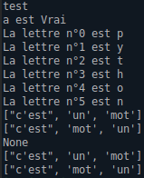

<br>

2. Installation des formateurs de code source :
- Installation du paquet [black](https://github.com/psf/black) (fonctionnel) :
```
sudo apt install black
```
- Lance le formatage du code Python du fichier test.py :
```
black {test.py}
```
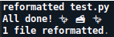

<br>

- Installation du paquet [isort](https://github.com/PyCQA/isort) (fonctionnel) :
```
sudo apt install isort
```
- Création d'un fichier "isort_test.py" :
```
sudo touch isort_test.py
```
- Ajout des importations tests :
```
sudo evim isort_test.py
```
- Lance dans le code Python le tri des importations par ordre alphabétique :
```
sudo isort isort_test.py
```

|             AVANT              |             APRES              |
|:------------------------------:|:------------------------------:|
| 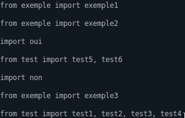 | 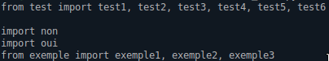 |

<br>

3. Installation des analyseurs statiques de code :
- Installation du paquet [bandit](https://github.com/PyCQA/bandit) (fonctionnel) :
```
sudo apt install bandit
```
- Recherche de problèmes de sécurité courants dans le code Python du fichier "test.py" :
```
sudo bandit test.py
```
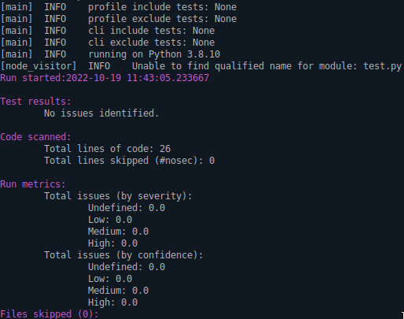

<br>

- Installation du paquet [pyflakes](https://github.com/PyCQA/pyflakes) (fonctionnel) :
```
sudo apt install pyflakes
```
- Création d'un fichier "test_pyflakes.py" :
```
sudo touch test_pyflakes.py
```
- Ajout d'une fonction test "Moyenne" :
```
sudo evim test_pyflakes.py
```
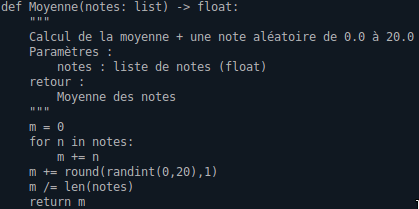
- Lance dans le code Python la vérification des fichiers source et de leurs éventuelles erreurs :
```
sudo python3 -m pyflakes test_pyflakes.py
```
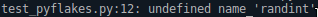 : Ici, la fonction "randint()" (ligne 12) n'est pas trouvée car elle n'a pas été importé

<br>

4. Installation d'un outil de vérification d’annotations de type :
- Installation du paquet [mypy](https://github.com/python/mypy) (fonctionnel) :
```
sudo apt install mypy
```
- Création d'un fichier "mypy_test.py" :
```
sudo touch mypy_test.py
```
- Ajout d'un test en Python :
```
sudo evim mypy_test.py
```
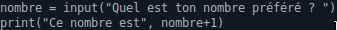
- Lance dans le code Python la vérification d'une utilisation correct des variables et des fonctions :
```
sudo isort isort_test.py
```
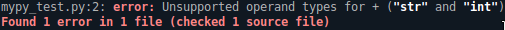 : Ici, nombre est de type str (chaine de caractères) donc l'addition avec le chiffre 1 n'est pas possible. Pour que cela fonctionne, il faut ajouter la fonction "int()" avant la fonction "input()"

<br>

5. Installation d'un outil de génération de documentation HTML à partir de docstrings :
- Installation du paquet [doxygen](https://github.com/doxygen/doxygen) (fonctionnel) :
```
sudo apt install doxygen
```
- Création d'un fichier "doxygen_test.py" :
```
sudo touch doxygen_test.py
```
- Ajout d'exemples de commentaires :
```
sudo evim doxygen_test.py
```
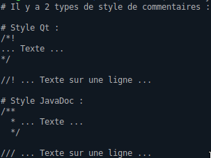

<br>

6. Installation d'un cadriciel de tests unitaires :
- Installation du paquet [check](https://github.com/libcheck/check):
```
sudo apt install check
```
- Création d'un fichier "check_test.py" :
```
sudo touch check_test.py
```
- Ajout d'une fonction test :
```
sudo evim check_test.py
```


<br>

7. Installation de la bibliothèque pygame (grâce à python3) :
- Installation du paquet [pygame](https://github.com/pygame/pygame) (fonctionnel) :
```
sudo apt-get install python3-pygame
```
- Création d'un fichier "test_pygame.py" :
```
sudo touch test_pygame.py
```
- Ajout d'un programme simple qui affiche un rectangle bleu dans un canvas :
```
sudo evim test_pygame.py
```
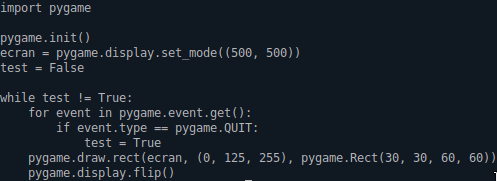
- Lance le fichier "test_pygame.py" avec Python :
```
python3 test_pygame.py
```


<br>

8. Installation de Git :
- Installation du paquet [git](https://github.com/git/git) (déjà installé et fonctionnel) :
```
sudo apt install git
```
- On se place dans */Documents* afin de créer un simple dépôt local :
```
cd /home/iut/Documents
```
- Création d'un fichier test "exemple.txt" :
```
sudo touch exemple.txt
```
- Initialisation d'un dépôt local dans *Document/* contenant "exemple.txt" :
```
git init
```
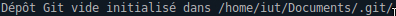

<br>

9. Installation de Meld (outil de comparaison et de fusion) :
- Installation du paquet [meld](https://github.com/GNOME/meld) (fonctionnel) :
```
sudo apt install meld
```
- Création d'un premier fichier de comparaison :
```
sudo touch test_meld1.txt
```
- Ajout d'une texte à comparer :
```
sudo evim test_meld1.txt
```
- Création d'un deuxième fichier de comparaison :
```
sudo touch test_meld2.txt
```
- Ajout d'une texte à comparer :
```
sudo evim test_meld2.txt
```
- Permet de comparer le contenu des deux fichiers :
```
meld test_meld1.txt test_meld2.txt
```
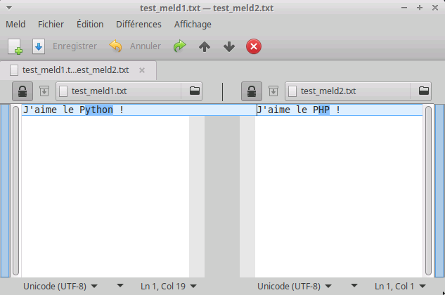

<br>

10.  Téléchargement de Visual Studio Code (en fichier .deb) :
- Téléchargement du fichier .deb sur le site de [Visual Studio Code](https://code.visualstudio.com/Download)
- Déplacement du fichier de *Téléchargement/* à */home/siko0001/* :
```
sudo mv Téléchargements/code_1.72.2-1665614327_amd64.deb /home/siko0001/
```
- On se place dans le répertoire */home/siko0001* :
```
cd /home/siko0001
```
- Installation du paquet DEB :
```
sudo dpkg -i /home/siko0001/code_1.72.2-1665614327_amd64.deb
```
- Installation des extensions :

|     Extensions      |           Image           |
|:-------------------:|:-------------------------:|
| Python de Microsoft |  |
|       Gitlens       | 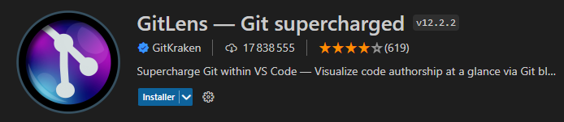 |

- Désactivation de la télémétrie : Fichier > Préférences > Paramètres > Application > Télémétrie (off)
11.  Ecriture de programmes Python :
- Création du fichier de test de programmes Python :
```
sudo touch test.py
```
- Ajout de 4 programmes Python :
```
sudo evim test.py
```
- Sortie des programmes dans un fichier "sortie_python.txt"

|           test.py (programmes)         |       sortie_python.txt (sortie)      |
|:--------------------------------------:|:-------------------------------------:|
|       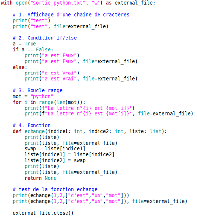       |   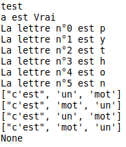    |

<br>

<hr>

<br>

## Structure du projet

<br><span style="color:red">___home/___</span>
<br>&emsp;&emsp;&emsp;<span style="color:orange">___iut/___</span>
<br>&emsp;&emsp;&emsp;&emsp;<span style="color:yellow">___Bureau/___</span>
<br>&emsp;&emsp;&emsp;&emsp;<span style="color:yellow">___Documents/___</span>
<br>&emsp;&emsp;&emsp;&emsp;&emsp;&emsp;<span style="color:lime">___exemple.txt___</span>
<br>&emsp;&emsp;&emsp;&emsp;<span style="color:yellow">___Images/___</span>
<br>&emsp;&emsp;&emsp;&emsp;<span style="color:yellow">___Modèles/___</span>
<br>&emsp;&emsp;&emsp;&emsp;&emsp;&emsp;<span style="color:lime">___OpenDocument Spreadsheet.ods___</span>
<br>&emsp;&emsp;&emsp;&emsp;&emsp;&emsp;<span style="color:lime">___OpenDocument Text.odt___</span>
<br>&emsp;&emsp;&emsp;&emsp;&emsp;&emsp;<span style="color:lime">___Plain Text.txt___</span>
<br>&emsp;&emsp;&emsp;&emsp;<span style="color:yellow">___mon_serveur/___</span>
<br>&emsp;&emsp;&emsp;&emsp;&emsp;&emsp;<span style="color:lime">___index.html___</span>
<br>&emsp;&emsp;&emsp;&emsp;<span style="color:yellow">___mon_Temp___</span>
<br>&emsp;&emsp;&emsp;&emsp;<span style="color:yellow">___Musique/___</span>
<br>&emsp;&emsp;&emsp;&emsp;<span style="color:yellow">___public_html/___</span>
<br>&emsp;&emsp;&emsp;&emsp;&emsp;&emsp;<span style="color:lime">___bienvenue.html___</span>
<br>&emsp;&emsp;&emsp;&emsp;<span style="color:yellow">___Téléchargements/___</span>
<br>&emsp;&emsp;&emsp;&emsp;&emsp;&emsp;<span style="color:lime">___PhpStorm-2022.2.2.tar.gz___</span>
<br>&emsp;&emsp;&emsp;&emsp;&emsp;&emsp;<span style="color:lime">___teams_1.5.00.23861_amd64.deb___</span>
<br>&emsp;&emsp;&emsp;&emsp;<span style="color:yellow">___Vidéos/___</span>
<br>&emsp;&emsp;&emsp;<span style="color:orange">___siko0001/___</span>
<br>&emsp;&emsp;&emsp;&emsp;&emsp;&emsp;<span style="color:lime">___code_1.72.2-1665614327_amd64.deb___</span>
<br>&emsp;&emsp;&emsp;&emsp;&emsp;&emsp;<span style="color:lime">___tests/___</span>
<br>&emsp;&emsp;&emsp;&emsp;&emsp;&emsp;&emsp;&emsp;<span style="color:cyan">___check_test.py___
<br>&emsp;&emsp;&emsp;&emsp;&emsp;&emsp;&emsp;&emsp;___doxygen_test.py___
<br>&emsp;&emsp;&emsp;&emsp;&emsp;&emsp;&emsp;&emsp;___isort_test.py___
<br>&emsp;&emsp;&emsp;&emsp;&emsp;&emsp;&emsp;&emsp;___mypy_test.py___
<br>&emsp;&emsp;&emsp;&emsp;&emsp;&emsp;&emsp;&emsp;___sortie_python.txt___
<br>&emsp;&emsp;&emsp;&emsp;&emsp;&emsp;&emsp;&emsp;___test_meld1.txt___
<br>&emsp;&emsp;&emsp;&emsp;&emsp;&emsp;&emsp;&emsp;___test_meld2.txt___
<br>&emsp;&emsp;&emsp;&emsp;&emsp;&emsp;&emsp;&emsp;___test.py___
<br>&emsp;&emsp;&emsp;&emsp;&emsp;&emsp;&emsp;&emsp;___test_pyflakes.py___
<br>&emsp;&emsp;&emsp;&emsp;&emsp;&emsp;&emsp;&emsp;___test_pygame.py___</span>
<br>&emsp;&emsp;&emsp;<span style="color:orange">___administrateur/___</span>

<br>

<hr>

<br>

## Problèmes rencontrés
- Aucun