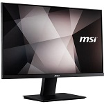
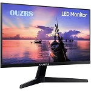
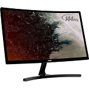
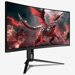
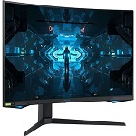
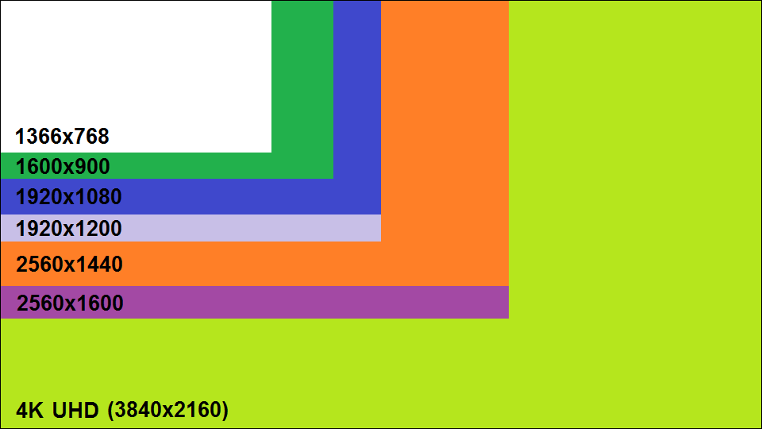

# Introduction
En guise d’introduction, je vous présente les différentes parties qui seront présentées :
- [Introduction](#introduction)
- [Principes de fonctionnement](#principes-de-fonctionnement)
- [Évolution](#évolution)
  - [Les types d'écran](#les-types-décran-computer)
  - [Rafraichissement d'écran](#rafraichissement-décran-collision)
  - [Les gammes d'écrans plats](#les-gammes-décrans-plats-high_brightnesswhite_square_button)
  - [Technologies de dalle](#technologies-de-dalle-pager)
  - [Dimensions](#dimensions-triangular_ruler)
  - [Résolution](#résolution-camera)
  - [Connectiques](#connectiques-electric_plug)
- [Bibliographie/sitographie](#bibliographiesitographie)

 

# Principes de fonctionnement
Un écran d'ordinateur est un périphérique d'affichage qui est généralement connecté à la carte graphique de l'ordinateur et qui affiche donc des images générées. Il donne l’impression de mouvement grâce au taux de rafraîchissement plus ou moins élevé d'un écran. Il permet finalement de travailler, visionner des vidéos, des films, de jouer à des jeux vidéo, de la bureautique et de nombreuses autres choses.

 

# Évolution

 

## Les types d'écran :computer:
- **L'écran cathodique :**
   - *__L'écran cathodique__ est composé de tube cathodique (tube à vide constitué d'un filament chauffé qui sous tension, créé un champ électrique). Ces tubes ont un rendu des couleurs réaliste mais sont volumineux et grands consommateurs d'énergie. Leurs productions sont arrêtés en 2009 mais ces tubes sont encore visibles dans d'anciens écrans Apple comme celui des Macintosh II.*

 

- **L'écran plat numérique :**
  - *__Les écrans LCD__ (Liquid Crystal Display) fonctionnent par rétroéclairage, ils ne produisent pas de lumière directe. Ils concentrent en un point la lumière à travers leurs cristaux liquides (état de la matière entre liquide ordinaire et solide cristallisé). Les écrans à technologie LCD sont moins coûteux que les écrans LED, plus petits, plus légers et facilement réparable. Leurs principal défaut est la lenteur comparé aux écrans récents.*
  - *__Les écrans DLP__ (Digital Light Processing) utilisent des millions de micro-miroirs orientables. Le principal fabricant de cette technologie est Texas Instruments.*
  - *__Les écrans à plasma__ fonctionne grâce aux gaz nobles (gaz rares : argon à 90 % et xénon à 10 %) qu’il contient et au courant électrique. Le gaz est transformé en plasma quand il est parcouru par le courant énergétique. Ces écrans sont coûteux et ont une durée de vie limitée. Il offre une belle qualité d’image et de bons contrastes. Il est aussi lourd, consomme beaucoup d’énergie et affiche une bonne persistance d’image. Cette technologie est peu répandu et est progressivement abandonnée.*
  - *__Le moniteur CTR__ utilisent un flux d’électron pour former des images sur un écran fluorescent. Ce type d’écran est identique à l'écran plasma pour sa consommation et son utilité.*
  - *__L’écran LED__ (Light-Emitting Diode) fonctionnent grâce à des diodes électroluminescentes (DEL ou LED capables d'émettre de la lumière lorsqu'ils sont parcourus par un courant électrique). Ces écrans offrent de belles images de bonne qualité, une saturation élevée et de bons contrastes. Ils sont très durables, chauffe peu et consomment peu d’énergie. Ces écrans sont cher et largement répandu sur le marché.*
  - *__Les écrans OLED et QLED__ (organic light-emitting diodes et Quantum Light Emitting Diode) sont des écrans haut de gamme à LED qui offrent une bonne qualité d’image. Par rapport à la LED normale, le temps de rafraîchissement est plus élevé, l'affichage est plus fin et brillant.*

 

 

## Rafraichissement d'écran :collision:
La fréquence de rafraîchissement correspond au nombre d'images par seconde s'affichant sur un écran. Cette fréquence est mesurée en hertz (Hz) et se situe généralement entre 60 Hz et 360 Hz. Plus la fréquence est élevée, plus le confort visuel et la fluidité sont améliorés.

À ne pas confondre avec la fréquence d'images qui s'exprime également en images par seconde (fps). Elle indique donc le nombre d'images que notre carte graphique produit chaque seconde. Par conséquent, si ma fréquence de rafraîchissement est de 60 hertz (Hz), nous avons besoin d'une carte graphique produisant au moins 60 fps.

 

|  Fréquence  |      Caractéristiques     | Exemple |
|:--------------: |:---------------:| :--------------:|
| Ecran 60Hz  | 60 images par seconde / fréquence de rafraichissement la plus basse / accessible en terme de prix / réactivité limitée |  |
| Ecran 120Hz | 120 images par seconde / meilleur rapport qualité/prix / bonne fluidité d’images |  |
| Ecran 144Hz | 144 images par seconde / très peu de différence avec un écran 120Hz / plus grosse marge de progression / plus grosse différence en terme de performances et de ressenti |  |
| Ecran 240Hz | 240 images par seconde / gameplay ultra fluide / très grande réactivité |  |
| Ecran 360Hz | 360 images par seconde / différences de plus en plus minime / mouvements fluides et rapides / adapté aux Fast FPS (jeu rapide à la première personne) |  |

 

 

## Les gammes d'écrans plats :high_brightness:/:white_square_button:
Il existe deux gammes d'écrans plats différents :
1. **Les écrans mats :** la visibilité est plus qualitative avec une lumière ambiante, moins de reflet. Cet écran est moins contrasté que l'écran brillant.
2. **Les écrans brillants :** surface réfléchissante avec un contraste amélioré. La visibilité alterne entre moyenne et médiocre si la luminosité ambiante est forte. Les couleurs sont plus belles que sur un écran mat.

 

 

## Technologies de dalle :pager:
Le type de dalle influe sur la réactivité de l'écran et la gamme de couleurs qu'il affiche. Il existe quatre principales familles de dalles :

- **Les moniteurs VA (Vertical Alignment), MVA (Multi-domain Vertical Alignment) et PVA (Patterned Vertical Alignment)** affichent des couleurs vives, plus claires et avec un faible temps de réponse. Ce moniteur a le meilleur rapport entre le rendu des couleurs et la réactivité de l'écran. Il est le plus préférable pour l'affichage vidéo mais est adapté à tout usage.
- **Les moniteurs IPS (In-Place Switching) et S-IPS (Super In-Place Switching)** affichent des couleurs plus précises, des meilleurs angles de vision que les autres moniteurs et des temps de réponse plus élevés. Ce type d'écran s'accommode parfaitement aux amateurs et professionnels de vidéos et de photographie.
- **Les moniteurs à panneaux PLS (Plane to Line Switching)** est une technologie spécifique utilisée par les écrans Samsung, elle permet d'avoir 10 % de luminosité en plus. Un meilleur angle de vision, une meilleure qualité d'image mais aussi des prix plus attractifs.
- **Les moniteurs TN (Twisted Nematic)** correspondent aux écrans à petit budget. Ils sont composés par une gamme de couleurs plus restreinte. Mais le temps de réponse est le plus rapide par rapport aux autres moniteurs.

 

 

## Dimensions :triangular_ruler:
En France, la taille de la diagonale d'un écran est calculée en pouce. Il correspond à environ 2,54 centimètres (cm).

__Par exemple :__ *Un écran de 24 pouces est en réalité un écran de 60,96 cm de diagonale.*

| Diagonale en pouces | Diagonale en cm |
|:--:|:-----:|
| 15 | 38.10 |
| 17 | 44.18 |
| 19 | 48.26 |
| 22 | 55.88 | 
| 24 | 60.96 |
| 26 | 66.04 |
| 28 | 71.12 |
| 30 | 76.20 |
| 32 | 81.28 |

 

 

## Résolution :camera:
La résolution est le nombre total de pixels sur un écran, qui se mesure en largeur x hauteur. Vous avez sûrement déjà entendu le terme 1080p en référence à un écran d'ordinateur ou de télévision. 1080p est une abréviation de 1920×1080 qui correspond à 1920 pixels de large par 1080 pixels de haut.

Il existe sept résolutions d’écrans standardisées. Elles se résument dans cet ordre :

- **HD** *est la résolution la plus utilisée, elle correspond à une résolution de 1366 x 768 pixels. Elle est adaptée à un usage de tous les jours.*
- **HD+** *correspond à une résolution de 1600 x 900 pixels. Elle permet un confort visuel correct sur un écran.*
- **Full HD** *correspond à une résolution de 1920 x 1080. Elle est majoritairement utilisé pour les écrans d'ordinateurs portables.*
- **QHD** *correspond à une résolution de 2560 x 1440. Sa définition est exactement quatre fois plus grande que le 720p.*
- **QHD+**  *correspond à une résolution de 3200 x 1800. Sa définition est quatre fois plus grande que la résolution HD+. Elle est la plus élevée sur les ordinateurs portables avec cette dimension.*
- **4K** *correspond à une résolution de 3840 x 2160. C’est la plus grande définition sur un écran d'ordinateur, elle est quatre fois plus grande que la résolution Full HD.*

 

 

## Connectiques :electric_plug:
Afin d'avoir un rendu graphique et un affichage de notre ordinateur, il faut le brancher à l'aide d'une grande variété de connectiques. Certains écrans proposant même plusieurs modes de branchement.

 

Il existes énormément de connectiques vidéos différents :
- **VGA** *ou Video Graphics Array st principalement utilisé pour connecter une carte graphique à un écran d'ordinateur de façon analogique.*
- **DVI** *ou Digital Visual Interface est utilisé pour connecter une carte graphique à un écran d'ordinateur de façon analogique (DVI-A / DVI-Analog) ou numérique (DVI-D / DVI-Digital).*
- **HDMI** *ou High-Definition Multimedia Interface est un connecteur vidéo et audio numérique qui transmet d'un ordinateur à un écran des données vidéo non compressées et des données audio compressibles. Il est le remplaçant de la prise péritel et est concurrencé par le DisplayPort.*
- **DisplayPort** *ou DP est un connecteur vidéo et audio numérique, il permet d'envoyer un son et une image en haute définition. Il regroupe les atouts du DVI et du HDMI.*
- **UDI** est un connectique vidéo numérique basée sur la norme DVI. Aujourd'hui, elle a complètement disparu. Elle permettait une compatibilité avec les interfaces HDMI et DVI mais ne supportait pas la transmission audio.
- **USB Type-C** ou USB-C est un connecteur normalisé USB utilisé pour la vidéo 4K et 8K. Il est créé à de nombreux usages (alimentation électrique, transfert de données, branchement de câble audio et sortie vidéo).

 

La vitesse de déplacement de données (ou bande passante ou encore débit) se calcule en Gigabytes par secondes ou Gb/s :
| Connecteur |    Version    | Vitesse |
|:----------:|:-------------:|:-------:|
|     VGA    |     450MHz    |   3.2   |
|     DVI    |  Analogique   |   4.95  |
|            |  Single Link  |   4.95  |
|            |   Dual Link   |   9.90  |
|    HDMI    |      1.0      |   4.95  |
|            |      1.1      |   4.95  |
|            |      1.2      |   4.95  |
|            |      1.3      |   10.2  |
|            |      1.4      |   10.2  |
|            |      2.0      |    18   |
|            |      2.1      |    48   |
|DisplayPort |      1.0      |   10.8  |
|            |      1.2      |   21.6  |
|            |      1.3      |   32.4  |
|            |      1.4      |   32.4  |
|            |      2.0      |    80   |
|    UDI     |    standard   |    16   |
|Thunderbolt |    1 / 1.2    |    20   |
|            |    2 / 1.2    |    20   |
|            |    3 / 1.4    |    40   |
|            |    3 / 2.0    |    80   |

 

# Bibliographie/sitographie
- [Wikipedia.org : Ecran d'ordinateur](https://fr.wikipedia.org/wiki/%C3%89cran_d%27ordinateur)
- [Ooreka.fr : Ecran d'ordinateur](https://ordinateur.ooreka.fr/comprendre/ecran-ordinateur)
- [Electrodepot.fr : Type d'écrans](https://www.electrodepot.fr/conseils/types-d-ecrans)
- [Maxesport.gg : Fréquence de rafraichissement d'un écran](https://maxesport.gg/fr/guides-conseils/60-hz-144-hz-240-hz-quelle-frequence-de-rafraichissement-choisir-pour-mon-ecran-gamer/)
- [lccm.fr : Résolution d'une dalle](https://www.lccm.fr/dalle-pc-portable/connaitre-resolution-dalle-pc-portable.html#:~:text=%C3%80%20l'heure%20actuelle%2C%20il,13%20et%2015%2C6%20pouces.)
- [Aidewindows.net : Taille d'un écran](https://www.aidewindows.net/materiel_ecran-taille.php)
- [ldlc-pro.com : Résolution d'un écran](https://www.ldlc-pro.com/peripheriques/moniteur-lcd/c5461/)
- [Aidewindows.net : Connecteurs d'écran](https://www.aidewindows.net/materiel_ecran_connecteurs.php#connecteurs)
- [Wikipedia.org : Connectiques vidéos](https://fr.wikipedia.org/wiki/Connectique#Connecteurs_en_vid%C3%A9o)
- [Comptoir-hardware.com : Connecteurs vidéos](https://www.comptoir-hardware.com/articles/cartes-graphiques/26923-dans-le-cambouis-connecteurs-video-a-definitions.html?start=6)
- [macg.co : Connecteur UDI](https://www.macg.co/2006/05/un-concurrent-pour-udi-16828)
- [Wikipédia.org : Définition d'ordinateur](https://fr.wikipedia.org/wiki/D%C3%A9finition_d%27%C3%A9cran)
- [Electrodepot.fr : Résolution d'écran](https://www.electrodepot.fr/conseils/resolution-d-ecran)
- [CommentCaMarche.net : Ecran d'ordinateur](https://web.maths.unsw.edu.au/~lafaye/CCM/pc/ecran.htm)
- [comparez-malin.fr : Tout savoir sur les résolutions](https://www.comparez-malin.fr/blog/tout-savoir-sur-les-resolutions-decrans/)